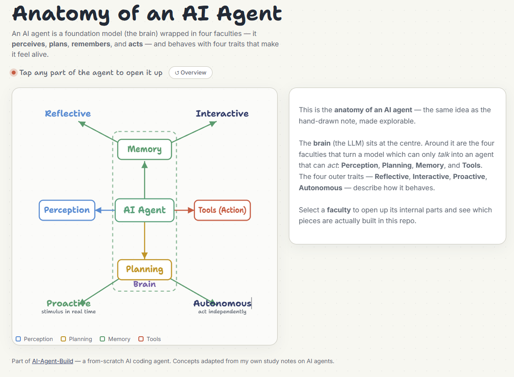
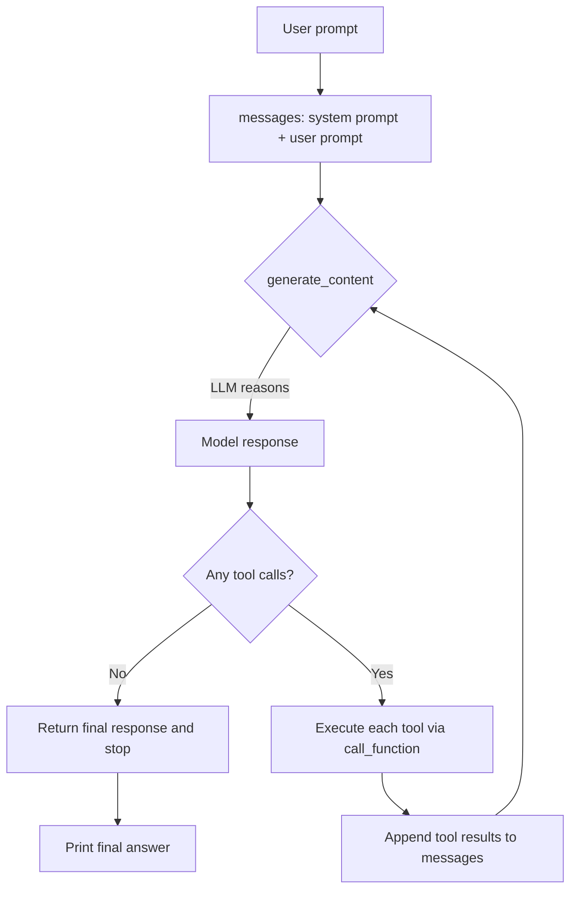

# AI Agent Build From Scratch

> A minimal, from-scratch AI coding agent: an LLM given *hands*. It reasons about a task, calls tools to act on a real codebase, observes the results, and repeats until the job is done.

Built with LLMs served through the [OpenRouter](https://openrouter.ai) API, a small set of Python tools/functions, and a bundled **calculator** application as the codebase the agent operates on.

---

## Table of contents

- [What is AI?](#what-is-ai)
- [What is an agent?](#what-is-an-agent)
- [So what is an AI agent?](#so-what-is-an-ai-agent)
- [Anatomy of an AI agent](#anatomy-of-an-ai-agent)
- [How this repo implements those ideas](#how-this-repo-implements-those-ideas)
- [The agentic loop](#the-agentic-loop)
- [The tools (the agent's hands)](#the-tools-the-agents-hands)
- [Project structure](#project-structure)
- [Getting started](#getting-started)
- [Usage](#usage)
- [How it works, step by step](#how-it-works-step-by-step)
- [Safety & sandboxing](#safety--sandboxing)
- [Concept → code map](#concept--code-map)
- [Limitations & roadmap](#limitations--roadmap)
- [Acknowledgements](#acknowledgements)

---

Before defining an *AI agent*, it helps to define its two words separately because the term is precisely the intersection of the two.
 
## What is AI?
 
**Artificial Intelligence** is the computational mimicry of human intelligence: the broad field of building systems that perform tasks we'd normally consider to require a human mind; understanding language, recognising patterns, reasoning about a problem, and making decisions.
 
A **Large Language Model (LLM)** is one product of that field. It's very good at *one* human-like ability: understanding and generating language. But an LLM on its own can only **talk**. It has no eyes, no hands, and no memory beyond the text in front of it. It can't check a file, call an API, or run a program. It's a brain in a jar.

## What is an agent?
 
Forget AI for a moment: the idea of an *agent* is older than software. An agent is anything that **perceives its environment and acts on it to achieve a goal**, making its own decisions along the way. A travel agent takes you from Point A (India) to Point B (Spain), and in the process *adds value* to your life (books your flights, preps your visa docs, sorts your hotels, and saving you time and money).
 
Build the definition up in layers:
 
1. **An agent adds value.** It moves you from *Point A* to *Point B* and improves things along the way. (A car does this too, so this alone isn't enough.)
2. **An agent plans and makes decisions.** Not just movement, but *judgement* about how to get there. (A self-driving car does this.)
3. **An agent has access to tools.** It can reach into the outside world and search, call APIs, send email, run code and take in feedback, and act again.
The common thread is a loop: perceive, decide, act, observe the result, and repeat.
 
## So what is an AI Agent?
 
Put the two together. An **AI agent** is an agent whose decision-making brain is an AI model:
 
> An **AI agent** is an artificial computational entity that is *aware of its environment* through **perception** (input), can *affect that environment* through **action** (tool use), and has *cognitive ability* from a **foundation model** — all backed by **short-term and long-term memory**.
 
In other words: take the LLM (the brain in a jar) and give it **hands, senses, and memory**. That's what turns a model that can only *talk* into a system that can *act* and run a self-improving loop:
 
```
Think  →  Act  →  Observe  →  (repeat)
```
 
Two one-line summaries worth remembering:
 
> **Agents are LLMs with hands.**
>
> The OpenAI SDK: *an agent is an LLM configured with instructions, provided with tools, and placed in an environment it can act on.*
 
This repo is a concrete, readable implementation of exactly that sentence.
 
> **Related term — *agentic system*:** an architecture built around *one or more* AI agents with autonomous decision-making, coordinating system components and resources to reach a goal while adapting to feedback. A single agent (like this repo) is the building block; an agentic system is what you get when you compose several of them.
 
---
 
## Anatomy of an AI agent
 
An AI agent is best pictured as a **brain wrapped in four faculties**. The foundation model (the brain) sits at the centre; around it, four components let it sense, think, remember, and act — and four outer traits describe how it behaves.
 
> 🔎 **Explore it interactively: [Anatomy of an AI Agent](https://dolamu-thedataguy.github.io/AI-Agent-Build/agent-anatomy.html)
 
The static version below renders inline on GitHub:


 
**The four faculties (the core):**
 
| Faculty | What it does | Made of |
|---|---|---|
| **Perception** | Takes in the world as input | Text, audio, images, other data forms |
| **Planning** | Reflects, reasons, and decomposes the goal (via the LLM) | Reflection, reasoning, decomposition |
| **Memory** | Holds state — the current task and (optionally) past knowledge | Short-term (cache, working memory); long-term (conversation store, episodic memory, knowledge base) |
| **Tools (Action)** | The hands — reaches out and changes something | Knowledge retrieval, web search, API calls, functions |
 
**The four traits (behaviour):** an AI agent is **Reflective** (evaluates its own output), **Interactive** (communicates with users and systems), **Proactive** (responds to real-time stimulus without step-by-step instruction), and **Autonomous** (acts independently toward a goal).
 
---
 
## How this repo implements those ideas
 
| Agent ingredient | In this repo |
|---|---|
| **LLM (foundation / reasoning engine)** | A model served via OpenRouter, called through the OpenAI-compatible SDK in `main.py` |
| **Instructions** | The system prompt in `prompt.py` |
| **Tools (the hands)** | Four Python functions in `functions/`, registered in `call_functions.py` |
| **Environment it can act on** | A sandboxed working directory — the bundled `calculator/` project |
| **The agentic loop (runtime)** | `generate_content()` inside `main.py`, called repeatedly up to `MAX_ITERS` |
| **Harness (system around the runtime)** | `main.py` + `call_functions.py` wiring the model, tools, and loop together |
| **Short-term / working memory** | The growing `messages` list carried across each turn of the loop |
 
---
 
## The agentic loop
 
The heart of the agent is a loop that runs until the model produces a final answer (or a safety cap is reached). Each pass through the loop is one **Think → Act → Observe** cycle.
 

 
- **Think** — the model reads the conversation so far and decides the next step.
- **Act** — if the model requests tool calls, `call_function()` runs the matching Python function.
- **Observe** — the tool's output is appended back into `messages` so the model can react to it on the next turn.
- **Repeat** — the loop continues, accumulating context, until the model responds with plain text and no further tool calls. A `MAX_ITERS` cap (in `functions/config.py`) prevents runaway loops.
---
 
## The tools (the agent's hands)
 
All four tools operate **only** inside the configured working directory. The agent never sees or supplies the working directory itself — it's injected automatically at call time for safety.
 
| Tool | What it does |
|---|---|
| `get_files_info` | Lists files and directories (with sizes) so the agent can explore the codebase |
| `get_file_content` | Reads the contents of a file |
| `write_file` | Writes or overwrites a file |
| `run_python_file` | Executes a Python file, with optional arguments |
 
Together these four give the agent enough reach to **inspect → understand → edit → verify** a codebase on its own: scan the directory, read the relevant files, make a change, then run the code and its tests to confirm the change works.
 
Tool registration lives in `call_functions.py`:
 
- `available_functions` — the list of tool schemas advertised to the LLM.
- `call_function()` — maps a requested tool name to its Python implementation, injects the `working_directory`, runs it, and returns the result as a `tool` message the loop can feed back to the model.
---
 
## Project structure
 
```
AI-Agent-Build/
├── main.py                    # Entry point + the agentic loop (generate_content)
├── prompt.py                  # System prompt (the agent's instructions)
├── call_functions.py          # Tool registry + dispatcher (call_function)
├── functions/                 # Tool implementations + config
│   ├── config.py              # WORKING_DIRECTORY, MAX_ITERS
│   ├── get_files_info.py      # List files/dirs (+ schema)
│   ├── get_file_content.py    # Read a file (+ schema)
│   ├── write_file.py          # Write/overwrite a file (+ schema)
│   └── run_python_file.py     # Execute a Python file (+ schema)
├── calculator/                # The demo codebase the agent operates on
├── response.json              # Latest raw model message (debug artifact)
├── requirements.txt           # Python dependencies
├── tests.py                   # Test entry
├── test_get_files_info.py     # Per-tool unit tests
├── test_get_file_content.py
├── test_write_file.py
├── test_run_python_file.py
└── .gitignore
```
 
---
 
## Getting started
 
### Prerequisites
 
- Python 3.10+
- An [OpenRouter](https://openrouter.ai) API key
### Installation
 
```bash
# 1. Clone
git clone https://github.com/Dolamu-TheDataGuy/AI-Agent-Build.git
cd AI-Agent-Build
 
# 2. (Recommended) create a virtual environment
python -m venv venv
source venv/bin/activate        # Windows: venv\Scripts\activate
 
# 3. Install dependencies
pip install -r requirements.txt
```
 
### Configuration
 
Create a `.env` file in the project root:
 
```env
OPENROUTER_API_KEY=your_openrouter_api_key_here
```
 
The app loads this at startup with `python-dotenv` and raises a clear error if the key is missing.
 
---
 
## Usage
 
The agent is a command-line tool. Pass it a natural-language prompt describing what you want done to the codebase:
 
```bash
python main.py "fix the bug in the calculator's operator precedence"
```
 
Add `--verbose` to see the full trace — token usage, each function call, and each tool result:
 
```bash
python main.py "add a modulo operator to the calculator and run the tests" --verbose
```
 
Example prompts:
 
```bash
python main.py "what files are in this project?"
python main.py "read the calculator's main file and explain what it does"
python main.py "the calculator gives the wrong answer for 3 + 7 * 2, find and fix it"
```
 
Because the agent starts by scanning the directory itself, you don't need to tell it where the code lives — it goes and looks.
 
---
 
## How it works, step by step
 
1. **Parse input.** `main.py` reads the `user_prompt` and optional `--verbose` flag via `argparse`.
2. **Load credentials.** The OpenRouter API key is loaded from `.env`; the OpenAI-compatible client is pointed at the OpenRouter base URL.
3. **Seed the conversation.** `messages` starts with the system prompt (`prompt.py`) and the user's prompt.
4. **Enter the loop.** Up to `MAX_ITERS` times, `generate_content()` is called:
   - The model is invoked with the current `messages` and the list of `available_functions`, at `temperature=0` for deterministic behaviour.
   - The model's message is appended to `messages` and dumped to `response.json` for inspection.
   - **If the model made tool calls**, each one is dispatched through `call_function()`, and every result is appended back to `messages`. The loop continues.
   - **If the model made no tool calls**, its text is the final answer — it's printed and the program exits.
5. **Safety cap.** If the loop hits `MAX_ITERS` without a final answer, it reports that the limit was reached and exits non-zero.
This is the **runtime** — the loop where the model observes, decides, calls, and acts — sitting inside the **harness** (`main.py` + `call_functions.py`) that surrounds it.
 
---
 
## Safety & sandboxing
 
- **Directory jail.** Every tool is confined to `WORKING_DIRECTORY`. The LLM works only in relative paths; the working directory is injected by the harness, never chosen by the model.
- **Explicit tool allow-list.** Only the four registered functions can run. Any unrecognised tool name returns a safe "unknown function" message instead of executing anything.
- **Iteration cap.** `MAX_ITERS` bounds how long the agent can loop, preventing infinite tool-calling.
- **Deterministic runs.** `temperature=0` keeps behaviour reproducible while you're developing and debugging.
---
 
## Concept → code map
 
For readers coming from the theory side, here's where each idea from the notes shows up in the source:
 
| Concept | Where it lives |
|---|---|
| *"An agent adds value, plans, and has tools"* | The whole `main.py` loop + `functions/` |
| *"LLMs are the bedrock; agents give them hands"* | OpenRouter client (brain) + tools (hands) |
| *Instructions* | `prompt.py` |
| *Tools / Actions* | `functions/*.py`, registered in `call_functions.py` |
| *Environment to act on* | `calculator/` under `WORKING_DIRECTORY` |
| *Thought → Action → Observation* | one pass of `generate_content()` |
| *Runtime (observe, decide, call, act)* | `generate_content()` |
| *Harness (system around the runtime)* | `main.py` + `call_functions.py` |
| *Short-term / working memory* | the accumulating `messages` list |
| *Autonomy (act independently)* | agent scans and decides without being told where files are |
 
> **Note on "memory":** memory here is *short-term / working* only — the in-context `messages` history that lasts for a single run. There's no persistent long-term store (episodic memory, a vector DB, etc.). That's a deliberate scope choice, and a natural place to extend the project (see below).
 
---
 
## Limitations & roadmap
 
This is an intentionally small, educational build — the goal is a clear, readable illustration of *how an agent actually works*, not a production coding assistant. Honest limitations and natural next steps:
 
- **No long-term memory.** Add a persistent store (conversation/episodic memory, or a vector DB for retrieval) to let the agent carry knowledge across runs.
- **Single, fixed sandbox.** Generalise `WORKING_DIRECTORY` so the agent can target any project.
- **Four tools.** Extend the tool set — web search, running shell commands, git operations, calling external APIs.
- **No streaming or UI.** It's CLI-only; a streamed or web interface would improve the experience.
- **Minimal error recovery.** The loop catches errors per turn but doesn't do sophisticated self-correction or reflection yet — a "reflect on failure and retry" step would make it noticeably more capable.
---
 
## Acknowledgements
 
- Built as a hands-on study of agent fundamentals — inspired by the "Build an AI Agent" style of project, adapted to run on **OpenRouter**.
- The conceptual framing (agent definitions, the Think → Act → Observe loop, perception / planning / memory / tools, control flow vs. agentic workflow) follows my own study notes on AI agents.
---
 
*Maintained by [Dolamu-TheDataGuy](https://github.com/Dolamu-TheDataGuy).*